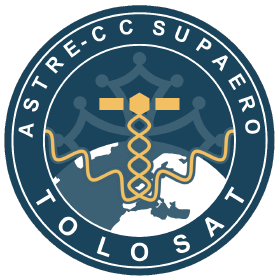

# TOLOSAT Official Website

As of now, the website is no longer maintained as media is replacing the old website using wordpress.
It will be kept here for legacy's sake.

  

Welcome to the official website of TOLOSAT. If you are interested in
contributing, please refer to our [contribution guidelines](/CONTRIBUTING.md).

## ⚙️ Requirements

You need to install the latest Node.js version and npm to run the website. You
can download both [here](https://nodejs.org/en/download/package-manager).

> [!IMPORTANT]
> To get autocompletion and a nice code environment, I recommend
> using [VSCode](https://code.visualstudio.com/) and install **workspace
> recommended extensions** in the extension panel.

## ⚡️ Quick Usage

To quickly run the website, you need to know the following commands:

| Command         | Description                       |
| --------------- | --------------------------------- |
| `npm install`   | Installs dependencies             |
| `npm run dev`   | Starts the development server     |
| `npm run build` | Builds the project for production |

> [!TIP]
> I recommend using [pnpm](https://pnpm.io/installation) instead of
> **npm** to save disk space and boost installation speed. More information
> [here](https://pnpm.io/motivation).

## ✨ Features

### 🎨 Color Codes

- 🟢 **Green**: The feature is finished and fully implemented.
- 🟠 **Orange**: The feature is currently being worked on.
- 🔴 **Red**: The feature has not yet been started.

### 👷 Current State

- 🔴 Start page
- 🔴 Light/Dark themes
- 🔴 More themes
- 🔴 i18n Internationalization for French and English
- 🔴 Table of contents for blog posts
- 🔴 Markdown blog posts using Mdsvex
- 🔴 RSS feed
- 🔴 Search Functionality
- 🔴 SEO friendly
- 🔴 Lazy image loading
- 🔴 Fast performance (perfect Lighthouse score)
- 🔴 Multi-language Support beyond French and English

## 📝 License

[MIT](/LICENSE.md)
