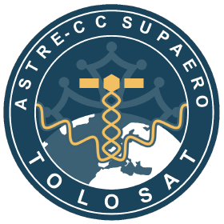

# TOLOSAT Official Website

This is TOLOSAT official website, if you want to contribute you can refer to this
[documentation](/CONTRIBUTING.md).

## ⚙️ Requirements

You need to install the latest Node.js version and npm to run the website. You can download both
[here](https://nodejs.org/en/download/package-manager).

To get autocompletion and a nice code environment, I recommend using
[VSCode](https://code.visualstudio.com/) and install **workspace recommended extensions**.

## ⚡️ Quick Usage

To quickly run the website, you need to know the following commands:

- `npm install` installs dependencies.
- `npm run dev` opens the website in your web browser.
- `npm run build` builds the website.

## ✨ Features

Nothing for now.

## 👷 Current State

TOLOSAT website is at its' very early stage.

## 📝 License

[MIT](/LICENSE.md)
